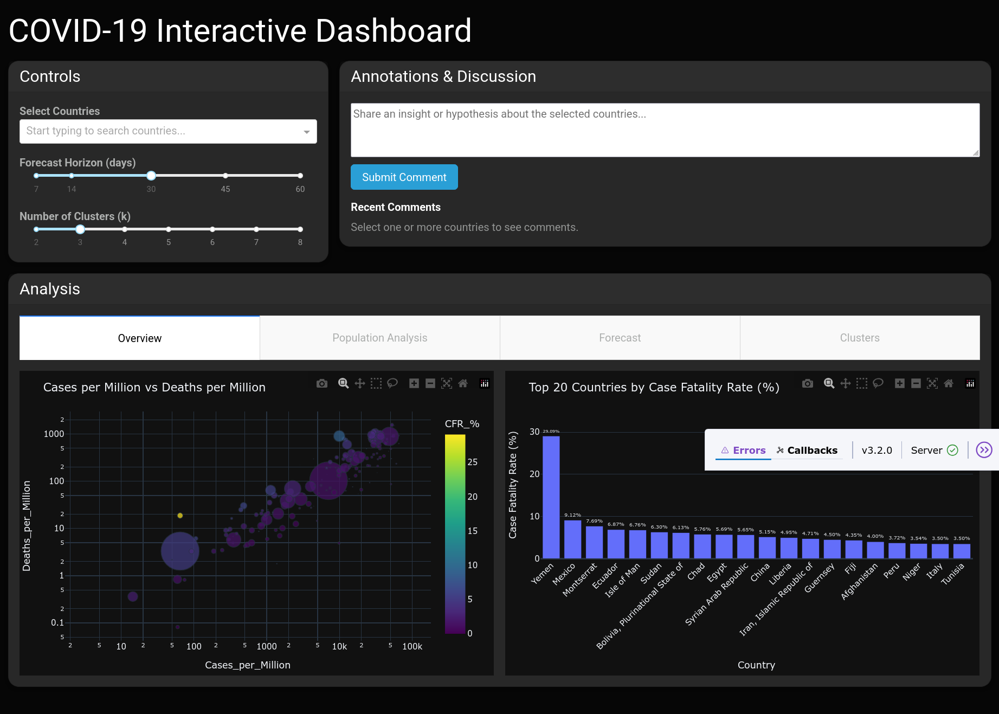

# COVID-19 Data Integration, Analysis, and Visualization Platform

A platform for integrating COVID-19 datasets, enriching them with demographic data, and providing APIs and dashboards for analysis, forecasting, clustering, and visualization.

---

### 🚀 Features

* **Data Integration:** Snowflake-based COVID-19 datasets + Kaggle world population data
* **API (FastAPI):** Query country-level summaries, historical series, clustering, and comments
* **Visualization (Dash/Plotly):** Interactive dashboards for trends, forecasting, and clusters
* **Comments & Annotations (MongoDB):**
* **Analytics:** Clustering, forecasting (Prophet), pattern recognition (Snowflake SQL)
* **Caching:** In-memory TTLCache to reduce query costs and latency

---

### 🛠️ Technology Stack

* **Snowflake** – Cloud data warehouse
* **Python** – Backend development, ETL, analysis
* **FastAPI** – REST API
* **MongoDB** – NoSQL storage for comments/annotations
* **Dash/Plotly** – Interactive dashboards
* **Other Libraries** – `pandas`, `scikit-learn`, `statsmodels`, `prophet`, `ydata_profiling`, `cachetools`, `dash-bootstrap-components`, `pydantic`

---

### 📦 Installation

#### 1. Clone the Repository

```bash
git clone https://github.com/VasilijsParfens/covid19-data-analysis.git
cd covid19-data-analysis
```

#### 2. Create & Activate Virtual Environment

```bash
python3 -m venv venv
source venv/bin/activate    # On Linux/macOS
venv\Scripts\activate       # On Windows
```
#### 3. Install Dependencies

```bash
pip install -r requirements.txt
```

### ⚙️ Configuration

#### Create a `.env` file in the project root (use `.env.example` as a template) with the following variables:

```bash
# MongoDB
MONGO_URI=mongodb+srv://<username>:<password>@<cluster-url>/<dbname>?retryWrites=true&w=majority&appName=<appName>

# Snowflake
SNOWFLAKE_USER=<your_snowflake_user>
SNOWFLAKE_PASSWORD=<your_snowflake_password>
SNOWFLAKE_ACCOUNT=<your_snowflake_account>
SNOWFLAKE_WAREHOUSE=<your_snowflake_warehouse>
SNOWFLAKE_DATABASE=<your_snowflake_database>
SNOWFLAKE_SCHEMA=<your_snowflake_schema>
SNOWFLAKE_ROLE=<your_snowflake_role>
SNOWFLAKE_TABLE=<your_snowflake_table>
```

### ▶️ Running the Project

#### 1. Start the FastAPI Backend

```bash
uvicorn api.main:app --reload --port 8000
```

#### 2. Start the Dash Dashboard

```bash
python visualization/app.py
```

#### Dashboard will be available at:

👉 ```http://127.0.0.1:8050```

### 📊 Example API Endpoints      

* ```GET /covid-data/?country=italy``` → Returns aggregated totals      

* ```GET /historical-data/?country=italy``` → Historical daily series      

* ```GET /cluster-countries/?k=3``` → Clustering results      

* ```POST /comments/``` → Add a comment for a country

### 📸 Screenshots

  
*Dashboard Homepage – Overview of global COVID-19 cases, deaths, and recoveries*  

  
*Forecasting – Prophet-powered case forecasting with confidence intervals*  

  
*Clustering Analysis – Grouping countries by case trends, population, and recovery rates*  

  
*Comments & Annotations – Add and view user notes linked to specific countries*  

### 🤝 Contributing

Contributions are welcome! Please fork the repo, create a branch, and submit a pull request.
